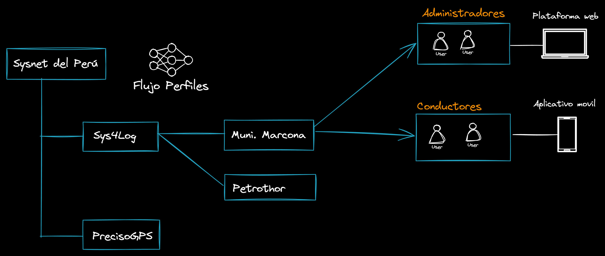

# eDispatch Backend

## Descripción General

eDispatch es una plataforma SaaS diseñada para gestionar registros de abastecimientos en diversas industrias, incluyendo combustibles y agua. El sistema soporta múltiples niveles de administradores y permite a las compañías finales registrar sus cisternas y conductores. Los conductores están equipados con una aplicación móvil y una impresora térmica para registrar los abastecimientos y generar tickets. La aplicación también puede integrarse con sistemas electrónicos para controlar y medir automáticamente el flujo del abastecimiento desde el dispositivo móvil. Los administradores pueden ver informes y configurar campos del formulario, gestionar clientes, puntos de entrega, y zonas a través de una plataforma web.

## Tabla de Contenidos
- [Características](#características)
- [Arquitectura](#arquitectura)
- [Instalación](#instalación)
- [Configuración](#configuración)
- [Ejecución de la Aplicación](#ejecución-de-la-aplicación)
- [Endpoints del API](#endpoints-del-api)
- [Esquema de la Base de Datos](#esquema-de-la-base-de-datos)
- [Contribuciones](#contribuciones)
- [Licencia](#licencia)

## Características
- Controles administrativos multinivel.
- Integración de aplicación móvil para conductores con capacidades de impresión térmica.
- Control automático del flujo de abastecimiento a través de la aplicación móvil.
- Administración basada en web para configuración e informes.
- Gestión de clientes, puntos de entrega, zonas, y más.

## Arquitectura


### Roles de Usuario
- **Super Master**: Control total del sistema.
- **Master**: Control a nivel de entidad administrativa o regional.
- **Compañía**: Entidad final que gestiona sus propios recursos.
    - **Administradores**: Acceso a través de la plataforma web para configuración e informes.
    - **Conductores**: Acceso a través de la aplicación móvil para registrar abastecimientos y generar tickets.

## Instalación

### Prerrequisitos
- Java 11+
- Maven 3+
- MySQL

### Pasos
1. Clonar el repositorio:
    ```bash
    git clone https://github.com/tu-repo/edispatch-backend.git
    cd edispatch-backend
    ```

2. Construir el proyecto:
    ```bash
    mvn clean install
    ```

3. Configurar la base de datos:
    - Crear una base de datos llamada `edispatch`.
    - Actualizar la configuración de la base de datos en `src/main/resources/application.properties`:
        ```properties
        spring.datasource.url=jdbc:mysql://localhost:3306/edispatch
        spring.datasource.username=tu_usuario_db
        spring.datasource.password=tu_contraseña_db
        ```

## Configuración
### Propiedades de la Aplicación
Configurar las propiedades de la aplicación en `src/main/resources/application.properties`:
```properties
# Configuración del Servidor
server.port=8080

# Configuración de la Base de Datos
spring.datasource.url=jdbc:mysql://localhost:3306/edispatch
spring.datasource.username=tu_usuario_db
spring.datasource.password=tu_contraseña_db

# Configuración de JPA
spring.jpa.hibernate.ddl-auto=update
spring.jpa.show-sql=true
```

## Ejecución de la Aplicación
Para ejecutar la aplicación, ejecuta el siguiente comando:
```bash
mvn spring-boot:run
```


## Esquema de la Base de Datos

### Tablas
- **masters**: Contiene datos maestros para Sys4Log.
- **companies**: Detalles de las compañías.
- **users**: Detalles de los usuarios.
- **administrators**: Detalles de los administradores.
- **drivers**: Detalles de los conductores.
- **zones**: Configuraciones de zonas.
- **settings**: Configuraciones de la aplicación.
- **tankers**: Detalles de las cisternas.
- **customers**: Detalles de los clientes.
- **points**: Puntos de entrega.
- **billings**: Información de facturación.
- **supplies**: Registros de abastecimientos.

## Estructura de Carpetas


## Contribuciones
¡Las contribuciones son bienvenidas! Por favor, lee nuestra [Guía de Contribuciones](./CONTRIBUTING.md) para empezar.

## Licencia
Este proyecto está licenciado bajo la Licencia MIT. Consulta el archivo [LICENSE](./LICENSE) para más detalles.

